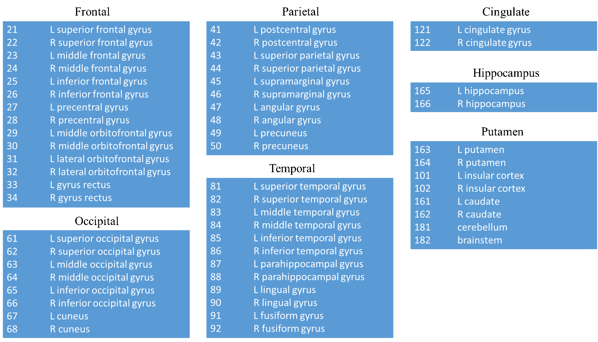

# Reimplemention-of-Dual-PRNet

This is a Tensorflow reimplemention of [Dual-Stream Pyramid Registration Network](https://arxiv.org/abs/1909.11966)

## Install
The packages and their corresponding version we used in this repository are listed in below.

- Tensorflow==1.15.4
- Keras==2.3.1
- tflearn==0.5.0

## Training
After configuring the environment, please use this command to train the model.

```sh
python train.py -g 0 --batch 1 -d datasets/brain.json -b DUAL -n 1 --round 10000 --epoch 10
```

## Testing
Use this command to obtain the testing results.
```sh
python predict.py -g 0 --batch 1 -d datasets/brain.json -c weights/Dec09-1849
```

## LPBA dataset
We use the same training and testing data as [RCN](https://github.com/microsoft/Recursive-Cascaded-Networks), please refer to their repository to download the pre-processed data.

## Results

Method |Dice | HD | assd |
---|:-:|:-:|:-:|
Original Dual-PRNet | 0.778 | -	| - |
Our re-implemented Dual-PRNet | 0.831±0.008 | 3.457±0.297 | 0.811±0.046
[VoxelMorph](https://arxiv.org/pdf/1809.05231.pdf) | 0.820±0.008 | 3.648±0.284	| 0.892±0.047 |
[VTN](https://arxiv.org/pdf/1902.05020.pdf) | 0.825±0.008 | 3.584±0.265 | 0.925±0.047
[2×10-cascade VTN](https://openaccess.thecvf.com/content_ICCV_2019/papers/Zhao_Recursive_Cascaded_Networks_for_Unsupervised_Medical_Image_Registration_ICCV_2019_paper.pdf) | 0.831±0.009 | 3.551±0.328 | 0.810±0.046

We have tried to follow [Dual-PRNet](https://arxiv.org/abs/1909.11966) to merge 56 regions into 7, and the merged 7 regions and the corresponding [label IDs](https://www.ncbi.nlm.nih.gov/pmc/articles/PMC2757616/) of functional areas in each merged region are shown in figure below.



## Acknowledgment

Some codes are modified from [RCN](https://github.com/microsoft/Recursive-Cascaded-Networks) and [VoxelMorph](https://github.com/voxelmorph/voxelmorph).
Thanks a lot for their great contribution.
